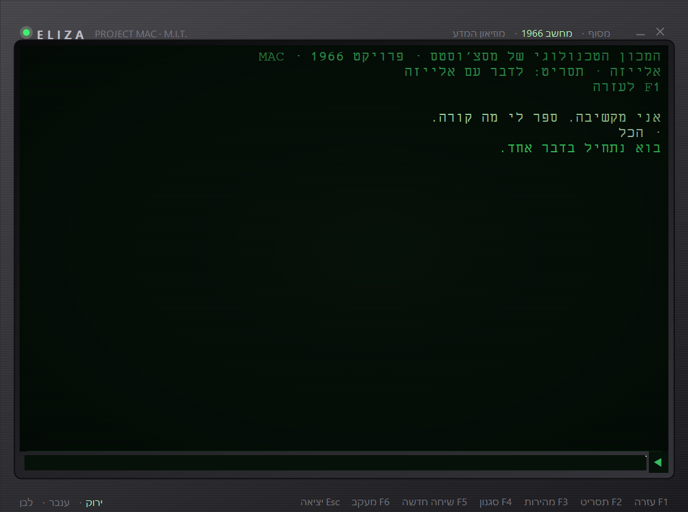
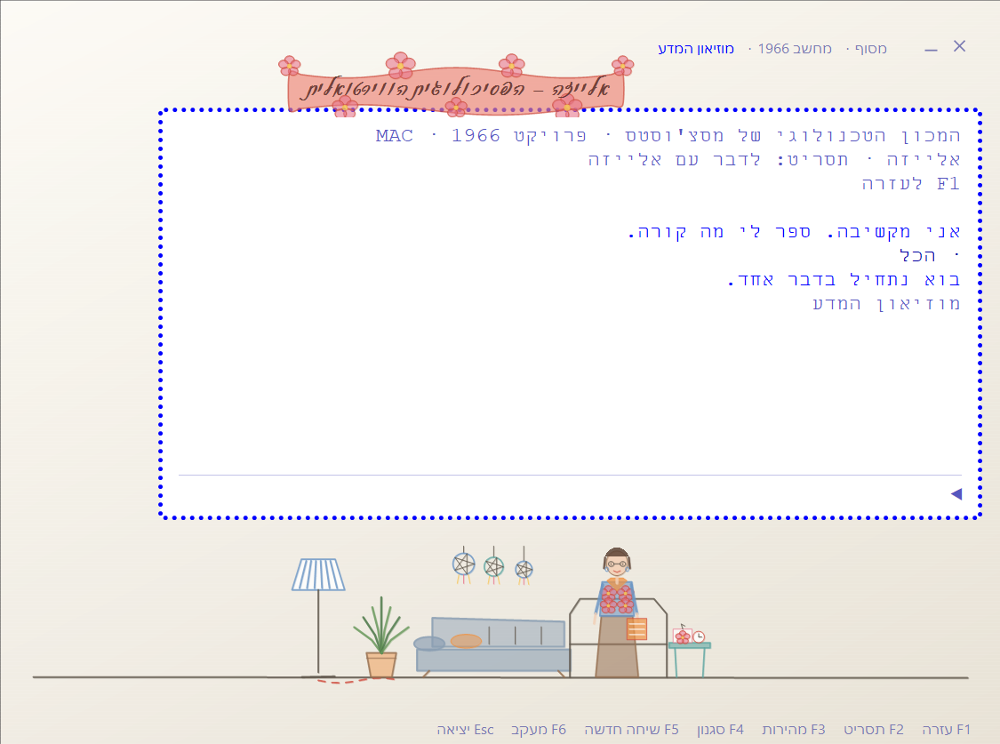

# אלייזה

התוכנית שוייצנבאום כתב במכון הטכנולוגי של מסצ'וסטס בין 1964 ל-1966, בנויה
מחדש כתוכנה לווינדוס — ובעברית.

קובץ הפעלה אחד, כ-5.1 מגה־בייט, בלי התקנה ובלי חיבור לאינטרנט. בפנים:
התסריט של 1966, תסריט עברי מקורי, ושישה שי-בוטים שנבנו על אותו מנוע.



---

## מה זה

אלייזה היא אחת התוכנות הראשונות ששוחחו עם בני אדם. אין בה שום הבנה: אין ידע
על העולם, אין מודל של שפה, אין למידה. יש בה כמה עשרות **כללי התאמה** שאדם כתב
ביד, והם פועלים על סדר המילים במשפט.

והיא עבדה. המזכירה של וייצנבאום ביקשה ממנו לצאת מהחדר כדי שתוכל לדבר איתה
ביחידות — והיא ידעה בדיוק איך זה בנוי. התופעה קיבלה שם: **אפקט אלייזה**,
הנטייה לייחס הבנה למכונה רק מפני שהיא מדברת.

---

## נאמנות למקור: מדידה, לא הצהרה

המנוע כאן הוא שחזור של האלגוריתם המקורי, והנאמנות שלו **נמדדת** ולא מוצהרת.

`build/extract_tests.py` שולף 127 חילופי דברים מתוך ערכת הבדיקות של מימוש
הייחוס, ומריץ אותם:

| מה נבדק | תוצאה |
|---|---|
| השיחה שוייצנבאום פרסם ב-1966 | 15 / 15 |
| המשך מדומיין של אותה שיחה | 21 / 21 |
| שיחה שסוטה מההקשר הטיפולי | 10 / 10 |
| התדפיס מקופסה 8 בארכיון שלו ב-MIT | 9 / 9 |
| השיחה שבמאמר מאוגוסט 1965 | 4 / 4 |
| הקטעים ששרדו מהשיחות של דוד אבידן, 1974 | 14 / 14 |
| מבחן שמפעיל **כל כלל וכלל** בתסריט | 68 / 68 |
| מבנה התסריט וקריאתו | 9 / 9 |
| החשבון של ה-IBM 7094 | 9 / 9 |
| התנהגות שהתסריט של 1966 לא נוגע בה | 12 / 12 |
| תשובות לשתיקה | 7 / 7 |
| הוראות שאינן של וייצנבאום | 10 / 10 |
| עמידות: שלושת תסריטי אלייזה, 414 קלטים מעוותים כל אחד | 6 / 6 |
| עמידות: ששת השי-בוטים, אותו דבר | 10 / 10 |
| עשרים ושתיים התקלות העבריות שנמצאו ותוקנו | 22 / 22 |
| שמונת התסריטים נטענים בלי אזהרה, כל תשובה מסתיימת בסימן, וכל תבנית יכולה להיתפס | 22 / 22 |
| **סך הכול** | **253 בדיקות, כולן עוברות** |

כל תו. לא "דומה" — זהה.

### מה שהמבחנים לא יכלו להוכיח

127 חילופי הדברים מוכיחים את המנוע **על התסריט הזה**. הם לא יכולים להוכיח
אותו על תסריט אחר — והתסריט הוא נתונים, אז מישהו יכתוב אחד.

לכן נערכה ביקורת נפרדת: ארבעה בודקים קראו את המנוע מול מימוש הייחוס שורה
בשורה, כל ממצא נמסר לבודק נוסף שתפקידו היה **להפריך** אותו, ומה ששרד תוקן.
מה שנמצא שם היה בדיוק מה שהמבחנים לא יכולים לתפוס:

- **תסריט באותיות קטנות היה מת.** קלט המשתמש מומר לאותיות גדולות, ואת
  התסריט לא המרתי — כך שמילות מפתח לא היו מתאימות לעולם.
- **שורת הפתיחה נבחרה לפי צורה ולא לפי מקום.** פתיחה בת מילה אחת הוחמצה,
  והכלל הראשון אחריה נבלע במקומה.
- **המרת אותיות.** הטבלה של .NET אינה הטבלה של המקור. סיגמה סופית ביוונית
  היא המקרה שנשבר: `.NET` משאיר את ς כמות שהיא, המקור הופך אותה ל-Σ, ומילת
  מפתח יוונית שמסתיימת בסיגמה לא הייתה מתאימה אף פעם.
- **חלוקת המילה לשישיות נמדדת בבתים.** לכן מילה עברית בוחרת בדיוק את ניסוח
  הזיכרון שהמקור היה בוחר. באנגלית אין הבדל — ובדיוק לכן אף שיחה מתועדת לא
  יכלה לגלות את זה.
- **סדר האיברים בכלל.** החלפה, דרגה ו-DLIST מותרים בכל סדר, כפי שהדקדוק של
  הייחוס עצמו מתעד.
- **כלל PRE פגום** הגיע לטבלת הכללים כמפתח ריק והפיל את התוכנה באמצע שיחה.

**שני הבדלים הושארו בכוונה,** ומוצהרים כאן במקום להיסתר:

1. סוגריים בתוך תבנית פירוק של MEMORY עובדים כאן ולא עובדים במימוש הייחוס,
   שקורא את התבניות האלה גולמיות. ההתנהגות השימושית נשארה, ובטעינת התסריט
   נרשמת אזהרה שאומרת את זה.
2. מצב ההתאמה לשש תווים של SLIP אינו ממומש. הוא נדלק רק בתסריט שמבקש אותו
   במפורש, ואין תסריט כזה כאן.

ובאג אחד לא נמצא בביקורת בכלל — הוא נמצא מהרצת התוכנה: התסריטים נפרקו פעם
אחת ואז קפאו, כך שכל גרסה חדשה הייתה ממשיכה לענות מהעותק הישן. עכשיו הם
חתומים ומתרעננים כל עוד החתימה תואמת; תסריט שנערך לא נדרס לעולם.

### מה נדרש בשביל זה

הדברים שקל לפספס, וששלושתם התגלו רק מהקוד שנמצא בארכיון ולא מהמאמר:

- **המילה `BUT` היא סימן פיסוק.** היא חותכת את המשפט כמו נקודה. המאמר מזכיר
  רק פסיק ונקודה.
- **מונה פנימי שמסתובב מ-1 עד 4.** הוא קובע גם איזו הודעת מילוט תיאמר, וגם
  מתי מותר לזיכרון לצוף. זיכרון עולה רק כשהמונה עומד על ארבע.
- **בחירת הזיכרון אינה אקראית.** המאמר אומר שהיא אקראית. הקוד מגלה שהיא נקבעת
  בגיבוב ריבוע־אמצע של קידוד ה-BCD של המילה האחרונה שהוקלדה. לכן יש כאן גם
  את מערכת התווים של ה-IBM 7094 וגם את החשבון ב-35 סיביות שלו.

### לשם השוואה

המימוש המוכר ביותר של אלייזה ברשת הוא גרסת הג'אווה של צ'ארלס היידן — אותה
גרסה שוויקיפדיה העברית מציגה, בטעות, כ"קוד המקור". הרצנו אותה מול אותן חמש
עשרה שורות: **11 מתוך 15**. היא נכתבה ב-1999 מתוך המאמר בלבד, ולכן לא יכלה
לדעת את שלושת הדברים שלמעלה.

`build/compare_java.py` מריץ את ההשוואה הזאת.

---

## התסריט העברי

> "תכונה חשובה של אלייזה היא שהתסריט הוא נתונים; כלומר, הוא איננו חלק
> מהתוכנית עצמה." — וייצנבאום, 1966

המנוע לא יודע אנגלית ולא יודע עברית. הוא יודע לחפש מילת מפתח, לפרק משפט לפי
תבנית, ולהרכיב תשובה. התסריט העברי הוא **קובץ נתונים**, וכל מה שצריך כדי
להוסיף שפה הוא לכתוב עוד אחד.

התסריט העברי אינו תרגום, ולא יכול להיות תרגום:

```
באנגלית   YOUR MOTHER   הכלל הוא   (0 YOUR 0 (/FAMILY) 0)
בעברית    אמא שלך       הכלל הוא   (0 (/משפחה) שלך 0)
```

ויש בעברית שלושה דברים שאין להם מקבילה באנגלית, ולכל אחד נדרש פתרון:

**אותיות שנדבקות למילה הבאה.** "שאני" היא מילה אחת, ולכן היא מילת מפתח בפני
עצמה, עם היפוך גוף משלה. מאותה סיבה אסור שאות בודדת תופיע בכלל הרכבה — היא
תצא מנותקת, "ש אתה", וזו לא עברית.

**שייכות שנכתבת כסיומת.** "אשתי" היא מילה אחת, וההיפוך הוא בתוך המילה. כל צורה
צריכה חליפין משלה, ואז קישור לכלל אחד משותף.

**המילה "את".** היא גם כינוי גוף וגם מילת יחס: ב"אני אוהב את אמא שלי" היא
איננה פנייה. הפתרון הוא כלל `PRE` של וייצנבאום עצמו — אותו מנגנון שבו טיפל
ב-`YOU'RE` — שמשכתב את המשפט ורק אז מעביר אותו לכלל אחר, ורק כשאחרי "את" בא
פועל בנקבה.

אלייזה עונה בלשון נקבה. וייצנבאום קרא לה על שם אלייזה דוליטל מ"פיגמליון" —
הנערה שלימדו אותה לדבר — והיא "she" לאורך כל המאמר שלו.

### מבנה הדאטיב

בעברית יש צורה שאין לה מקבילה באנגלית, והיא **חסינת מין לחלוטין**:

> קשה לי · כואב לי · נמאס לי · אכפת לי · מפריע לי

אין בה כינוי גוף כלל, ולכן אותו כלל בדיוק עובד לגבר ולאישה. זה הרווח שהשפה
נותנת בתמורה לכל הקושי שהיא מייצרת — בדיוק כפי שהמתרגם של אלייזה לגרמנית
הוסיף מעצמו כלל ל-`mir ist *`, שאין לו מקבילה באנגלית.

מעניין ששני שברי הפלט היחידים ששרדו מאלייזה עברית קודמת בנויים בדיוק כך:
*"יש מישהו שאתו **קל לך** יותר לדון בנושא?"* ו*"למה אתה אומר ש**כואב לך**
הראש?"*. התסריט כאן מחזיק משפחת כללים שלמה על הצורה הזאת.

השלילה שם דורשת תבנית נפרדת. בלעדיה המילה "לא" נופלת לתוך הכוכבית הפותחת,
לא מגיעה לשום כלל הרכבה, והמשמעות מתהפכת בשקט: *"לא קל לי"* היה חוזר
כ*"כמה זמן קל לך"*. באג כזה לא נתפס בקריאה — רק בהרצה.

### שני מגני תסריט

שניהם רצים בזמן טעינת התסריט:

- **אינדקס רכיב מחוץ לתחום.** כלל שמפנה לחלק שהפירוק שלו לא מייצר. זו בדיקה
  שהייתה כבר אצל וייצנבאום.
- **אות תחילית מנותקת.** אות עברית בודדת בכלל הרכבה. זו בדיקה עברית.

---

## שי-בוטים

> "תכונה חשובה של אלייזה היא שהתסריט הוא נתונים."

אם זה נכון, אפשר לבדוק אותו. שישה תסריטים נוספים רצים על אותו מנוע בדיוק,
בלי שורת קוד אחת שהשתנתה:

| | מה זה | מילות מפתח | תבניות | תשובות |
|---|---|---|---|---|
| **אלייזה רבתי** | אלייזה עצמה, עם תסריט גדול פי כמה | 2,125 | 4,400 | 10,337 |
| **הצ’יקאבער** | בחור ישיבה חד, ובלי סבלנות לפלפול שנמרח | 1,229 | 1,528 | 4,031 |
| **המשגיח** | שיחת מוסר. קצר, ולא נעים | 1,159 | 2,180 | 4,467 |
| **השדכן** | כל מה שתאמרו נהפך אצלו לשורה בפרופיל | 1,217 | 2,057 | 4,957 |
| **הדיין** | טענה, ראיה, סעד. ובלי לשמוע צד אחד | 1,848 | 2,259 | 4,301 |
| **הצו"ל** | נתפס לכל מילה ומבקש שתגדירו אותה | 978 | 2,529 | 5,763 |
| | לשם השוואה: התסריט העברי | 895 | 512 | 1,588 |

**אלייזה רבתי** היא השאלה מה היה קורה אילו מישהו היה ממשיך לכתוב את התסריט
של 1966 עוד עשר שנים. אותה דמות, אותו מנוע, ופי כמה הבחנות: זמן עתיד שלם
שלמקור אין (`אני אנסה` חוזר `מתי תנסה?` במקום להישבר), תבנית שלילה לכל
משפחה שמצטטת בחזרה, הבחנה בין מה שאמרת על עצמך למה שאמרת על מישהו אחר,
ותיוג לפי סוג המילה ולא לפי המילה.

והארבעה האחרים כבר אינם אלייזה. הם עושים בדיוק את אותו הדבר — מחפשים מילת
מפתח, מפרקים את המשפט לפי תבנית, ומרכיבים תשובה — ויוצא מזה מישהו אחר לגמרי:

**הצ'יקאבער** חד ומהיר, תופס סברא לפני שסיימתם את המשפט, ובדיוק מפני שהוא
חד אין לו סבלנות לפלפול שנמרח. **המשגיח** הוא ההפך מן הפסיכולוגית: היא משקפת
ומחכה, והוא שואל מה עשית ולא איך הרגשת. **השדכן** הופך כל תכונה לדרישה וכל
דאגה לפשרה. **הדיין** מבקש טענה, ראיה וסעד, ואינו שומע צד אחד. **הצו״ל**
נתפס למילה רגילה שאמרתם ומבקש שתגדירו אותה — כמה זמן זה "תכף", ומה בדיוק
"כמעט".

הלכות לשון הרע יושבות אצל שניים, ואחרת בכל אחד: אצל המשגיח כתביעה מוסרית,
ואצל הצו״ל כדקדוק בגדרים.

אין באף אחד מהם למידה, רשת, או משהו מלבד הקובץ. אם אחד מהם נשמע משכנע, זה
אומר בדיוק מה שוייצנבאום אמר ב-1966.

לכל אחד יש חדר משלו תחת **מותאם לדמות**, ותסריט חדש מבקש אחד בהוראה
`(SCENE ...)`. ההוראות שתסריט יכול לשאת:

```
(NAME שם על הכרטיס)
(ABOUT משפט אחד מתחתיו)
(SCENE BEIS)          החדר: MUSEUM · TELETYPE · BEIS · MUSSAR · TAPES
(FAMILY MODEL)        על איזה מדף במסך הפתיחה
(DIRECTION RTL)
```

אף אחת מהן אינה של וייצנבאום, וכולן אופציונליות — התסריט שלו אינו נושא
אחת, ופענוח שלו נותן בדיוק את ההתנהגות שלו.

---

## מה היה לפני

**אלייזה עברית אחת נבנתה לפנינו, ואי אפשר לדעת כמה היא הייתה נאמנה.**

ערן הדס בנה אותה ב-2010–2011 עבור תערוכת "קאפצ'ה" במוזיאון המדע ע"ש בלומפילד
בירושלים. היא רצה כאפליקציית שרת בג'אווה. שני השרתים שאירחו אותה כבויים היום,
הקוד מעולם לא פורסם, ובחיפוש מאגרים ב-GitHub אין לה זכר.

מה ששרד הוא צילום אחד של דף ה-HTML של האפליקציה החיה, משנת 2019. אפשר לקרוא
ממנו שני דברים בלבד: היה בה שדה מין משתמש עם ברירת מחדל "זכר", והיא פנתה
למשתמש בזכר יחיד. האם מתחת לזה עמד מנוע מפתחות־פירוק־הרכבה אמיתי, או משהו
קל יותר — לא ידוע, ואין דרך לדעת.

מעבר לזה לא נמצא דבר: לא תסריט עברי, לא מאגר קוד, ולא ערך עברי בקטלוג
התסריטים של elizagen.

לכן הניסוח הזהיר הוא: **זהו תסריט DOCTOR העברי הראשון שקיים כקוד קריא.**
לא "הראשון שנבנה".

### דוד אבידן, וכמה דברים שצריך לומר בדיוק

ספרו של אבידן **"הפסיכיאטור האלקטרוני שלי: שמונה שיחות אותנטיות עם מחשב"**
(1974) הוא המפגש הישראלי המפורסם עם אלייזה. שלוש הסתייגויות:

- **השיחות התנהלו באנגלית.** העברית שבספר היא תרגום של אבידן עצמו. לא הייתה
  אלייזה דוברת עברית ב-1974.
- **האותנטיות שנויה במחלוקת,** לא הוכחה ולא הופרכה. צבי ינאי, שסידר את הגישה
  למחשב, הביע ספק. המילה "אותנטיות" שבכותרת המשנה היא טענת המחבר.
- **אין לקבוע מקום ותאריך.** קיימות שלוש גרסאות בלתי מתיישבות על מתי ואיפה
  זה קרה. "פורסם ב-1974" זה כל מה שאפשר לומר בביטחון.

וייצנבאום עצמו הזכיר שהיו תסריטים בוולשית ובגרמנית. בארכיון שלו שרדו רק
האנגליים.

---

## שתי שכבות

התוכנה נפתחת ב**חדר** — מעטפת מודרנית, כהה ושקטה, שבה בוחרים תסריט וקוראים
על אלייזה. משם נכנסים אל **מכונה מ-1966**, ארון פלסטיק עם מסך פוספור.
המרחק בין השתיים הוא העניין.

לחלון השיחה שלושה סגנונות. שניים מהם הם על המכונה — מסוף, או הקונסולה של
1966 — והשלישי הוא על מי שמדברים איתה. **מותאם לדמות** מציג את החדר של
התסריט עצמו: אצל אלייזה בעברית זה חדר ההמתנה שהוצג במוזיאון המדע, אצל
התסריט האנגלי זו מכונת הטלפרינטר שממנה היא באמת יצאה ב-1966, ולכל שי-בוט
יש חדר משלו. התסריט אומר איזה, בהוראה `(SCENE ...)` משלו.

רעיון החדר בא מאלייזה העברית שהציג מוזיאון המדע ב-2010, שהצילום היחיד ששרד
ממנה הוא ציור ידני של חדר פסיכולוגית. הציור כאן שלנו; רק המחשבה מושאלת.

והוא מיישב שאלה שהמקור משאיר פתוחה: **בתסריט של 1966 אין פרידה ואין דרך
לצאת**, ולא המצאנו לה אחת. לא מסיימים את השיחה — קמים ויוצאים מהחדר.

**המעטפת זוכרת. אלייזה לא.** מה שנבחר, מה שנשמר, איזה צבע מסך — הכול שייך
לתוכנה שסביבה. בתסריט המקורי יש כלל למילה `NAME` בדרגת קדימות כמעט עליונה,
וכל תוכנו הוא סירוב לעסוק בשמות. וייצנבאום לא שכח לתת לה זיכרון אישי.
הוא כתב לה את הסירוב.

בדיקת עדכונים כבויה, ואין מאגר מוגדר. התוכנה אינה פונה לרשת.

---

## שימוש

**להורדה:** [הגרסה האחרונה](https://github.com/BeniaBot/eliza/releases/latest) —
קובץ הפעלה אחד, בלי התקנה. ווינדוס יציג מסך כחול על קובץ שאינו חתום
בתעודה מסחרית: *More info* ואז *Run anyway*.

ובהגדרות יש מתג לבדיקת עדכונים. הוא כבוי, ובזמן שהוא כבוי התוכנה אינה פונה
לרשת בשום שלב. כשהוא דלוק היא שואלת את גיטהאב מה שם המהדורה האחרונה, ואם
יש חדשה — מורידה ומחליפה את עצמה בלחיצה אחת.

הריצו `build.cmd` ותקבלו את `dist\ELIZA.exe`. אין מה להתקין, ואין
צורך בערכת פיתוח: הקומפיילר שהבנייה משתמשת בו מגיע עם ווינדוס.
התיקייה `dist` אינה נשמרת במאגר, ולכן היא אינה קיימת עד שבונים.

במעטפת: הספרות `1` עד `5` נכנסות לתסריט, `Ctrl+1` עד `Ctrl+5` עוברות בין
העמודים, `Esc` חוזר. בשיחה:

| מקש | פעולה |
|---|---|
| `F1` | עזרה |
| `F2` | מעבר לתסריט הבא |
| `F3` | מהירות הקלדה: מיידית, מהירה, או טלפרינטר בעשרה תווים בשנייה |
| `F4` | סגנון המסך: מסוף, מחשב 1966, מותאם לדמות |
| `F5` | שיחה חדשה |
| `F6` | מעקב — מראה איזה כלל פעל בכל תשובה |
| `F7` `F8` | גודל הטקסט |
| `Ctrl+S` | שמירת התמליל |
| `Ctrl+C` | העתקת השיחה כולה |
| `PageUp` `PageDown` | גלילה אחורה בשיחה |
| חצים | מה שהקלדתם קודם |
| `Esc` | מדלג על ההקלדה, ושוב יוצא |

סגנון המסך וצבע המסך הם גם מילים שאפשר ללחוץ עליהן בחלון עצמו — בשורה
העליונה ובשורה התחתונה.

`F6` שווה לחיצה. הוא מראה את המכונה עובדת: איזה כלל נתפס, איך פורק המשפט,
ומאיזה ניסוח נבנתה התשובה.

וזה מה ש**מותאם לדמות** נראה כמו אצל אלייזה בעברית — חדר ההמתנה שהוצג
במוזיאון המדע, מצויר כאן מחדש, קו בקו, מתוך רשימה של מה שהיה בו:



### התסריטים

בהרצה הראשונה התוכנה פורקת את כל התסריטים אל
`%LOCALAPPDATA%\Eliza\scripts`. הם קובצי טקסט רגילים ואפשר לערוך אותם.

אם תיקייה בשם `scripts` יושבת ליד קובץ ההפעלה, היא גוברת — כך אפשר לשאת את
הכול על החסן נייד.

---

## בנייה

```
build.cmd
```

הבנייה משתמשת במהדר ה-C# שמובנה בתוך ווינדוס. לא מורידה כלום, לא מתקינה כלום,
ולא דורשת ערכת פיתוח. היא גם מריצה את כל 253 הבדיקות ונעצרת אם אחת נכשלת.

```
src/Eliza.cs             המנוע, מפרש התסריטים, וחשבון ה-IBM 7094
src/CaseTable.cs         מערכת התווים של ה-IBM 7094
src/Program.cs           נקודת כניסה ופריקת התסריטים
src/Updater.cs           הדבר היחיד בתוכנה שפונה לרשת, וגם הוא רק אם ביקשו
src/Settings.cs          ההגדרות, וכל מילה שהתוכנה אומרת בשתי השפות
src/Shell.cs             המעטפת: מסך הפתיחה, ההגדרות, התמלילים
src/Widgets.cs           הפקדים — מתגים, כרטיסיות, פס גלילה, כרטיסים
src/AboutText.cs         עשרת הפרקים של "על אלייזה"
src/Ui.cs                חלון השיחה
src/Scenes.cs            החדרים: מוזיאון, טלפרינטר, בית מדרש, מוסר, 7094,
                         סלון של שדכן, בית דין, פינת לוח המודעות
src/Museum.cs            חדר ההמתנה של מוזיאון המדע, מצויר מחדש
src/Test.cs              מריץ הבדיקות, בודק התסריטים, ודוח הכיסוי לעברית
src/Conversations.cs     127 חילופי הדברים, נוצר אוטומטית

scripts/doctor.txt       התסריט של 1966
scripts/doctor.he.txt    התסריט העברי
scripts/doctor.he.f.txt  אותו תסריט בלשון נקבה, נוצר בזמן הבנייה
scripts/rabati.he.txt    אלייזה רבתי
scripts/chikaber.he.txt  הצ'יקאבער
scripts/mashgiach.he.txt המשגיח
scripts/shadchan.he.txt  השדכן
scripts/dayan.he.txt     הדיין
scripts/tzul.he.txt      הצו״ל

reference/               מימוש הייחוס והתעתיק השני, לצורך השוואה
```

בדיקת תסריט — מה יש בו, ומה לא בסדר בו:

```
build\out\ElizaTest.exe --check doctor.he.txt
```

שיחה ישירה עם תסריט, בלי הממשק:

```
build\out\ElizaTest.exe --talk mashgiach.he.txt
```

בדיקת התסריט העברי:

```
build\out\ElizaTest.exe --hebrew
```

הפקודה מריצה את כל הקלטים שב-`build/probes.he.txt`, מדפיסה את התשובה בפועל
לכל אחד, ומדווחת אילו כללים לא נורו אף פעם.

---

## מקורות וזכויות

- **התסריט של 1966** הוא תעתיק של הנספח למאמר של וייצנבאום,
  *ELIZA — A Computer Program For the Study of Natural Language Communication
  Between Man and Machine*, Communications of the ACM, ינואר 1966.
  זכויות המאמר שמורות ל-ACM; התסריט מובא כאן בשלמותו לצורכי לימוד, עם
  הייחוס שהתעתיק נושא.

- **קוד המקור המקורי ב-MAD-SLIP** נמצא בארכיון של וייצנבאום ב-MIT ושוחרר על
  ידי העיזבון שלו כנחלת הכלל מלאה:
  [jeffshrager/elizagen.org](https://github.com/jeffshrager/elizagen.org/tree/master/1965_Weizenbaum_MAD-SLIP)

- **מימוש הייחוס** שממנו נשאבו הבדיקות:
  [anthay/ELIZA](https://github.com/anthay/ELIZA)

- **הקוד המקורי רץ** על חיקוי של מחשב משנות השישים:
  [rupertl/eliza-ctss](https://github.com/rupertl/eliza-ctss)

התסריט העברי והתוכנה עצמה נכתבו כאן.

---

וייצנבאום עצמו נחרד ממה שיצר. הוא התחיל כמדען מחשב נלהב וסיים ככותב *כוח
המחשב והתבונה האנושית*, ספר ביקורת חריף על התחום. הטענה שלו הייתה שיש דברים
שלא ראוי למסור למכונה, גם אם היא מסוגלת לעשות אותם.

הוא כתב את אלייזה כדי **לפוגג** את הקסם. זה לא עבד.
